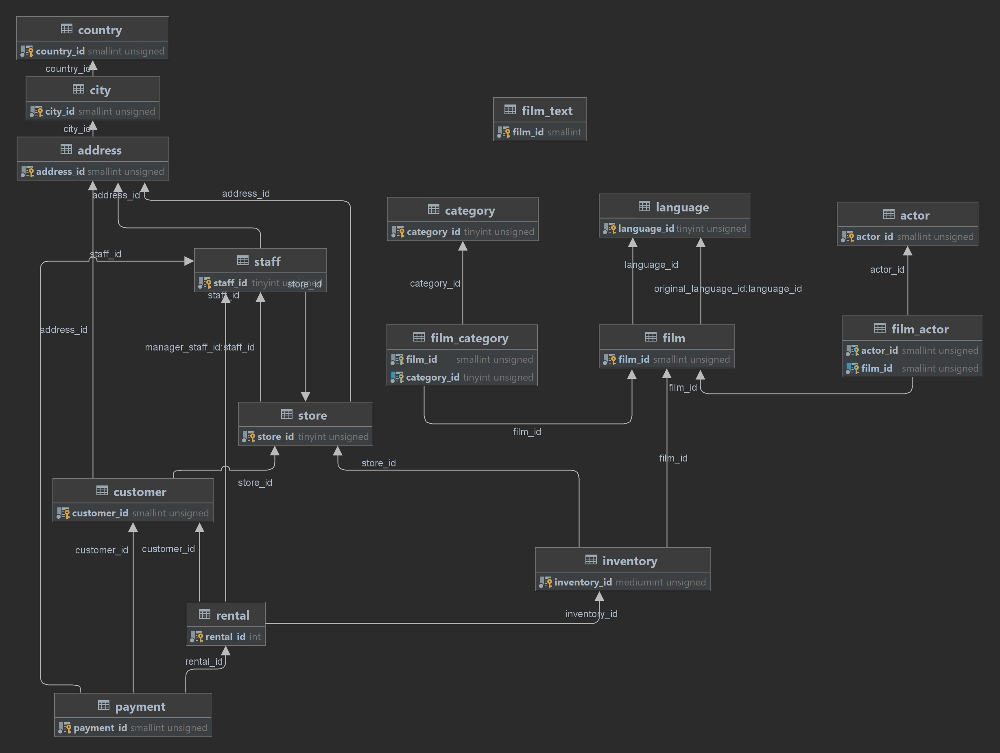

# Проект по теме: Hibernate (2)
JRU Uniform - М4 - Мини-проект 2

<!--Установка-->
## Установка

1. Открыть [дамп-файл](./dump-hibernate-2.sql) и развернуть его у себя на локальной машине.
   В качестве БД мы будем использовать тестовую БД, которая распространяется в качестве примера вместе с установочным пакетом MySQL. Дамп нужен для того, чтоб зафиксировать состояние БД.

2. Это maven проект со всеми необходимыми зависимостями (hibernate-core-jakarta, mysql-connector-java, p6spy).

3. Подключи в Идее локальную развернутую БД как datasource. Схема movie.
4. Запускать Main.java
5. Схема выглядит примерно так:

## Предложения по улучшению структуры таблицы
1. В таблице film изменить колонку rating, так как используется Java, чтобы не делать Converter (c NC-17 на NC17 и PG-13 на PG13).
2. В таблице film изменить колонку special_features, так как нарушается проектирование БД (выборка, поиск, сравнение). Добавить связь ManyToMany.
3. ID в таблицах должны быть одного типа , например Long.